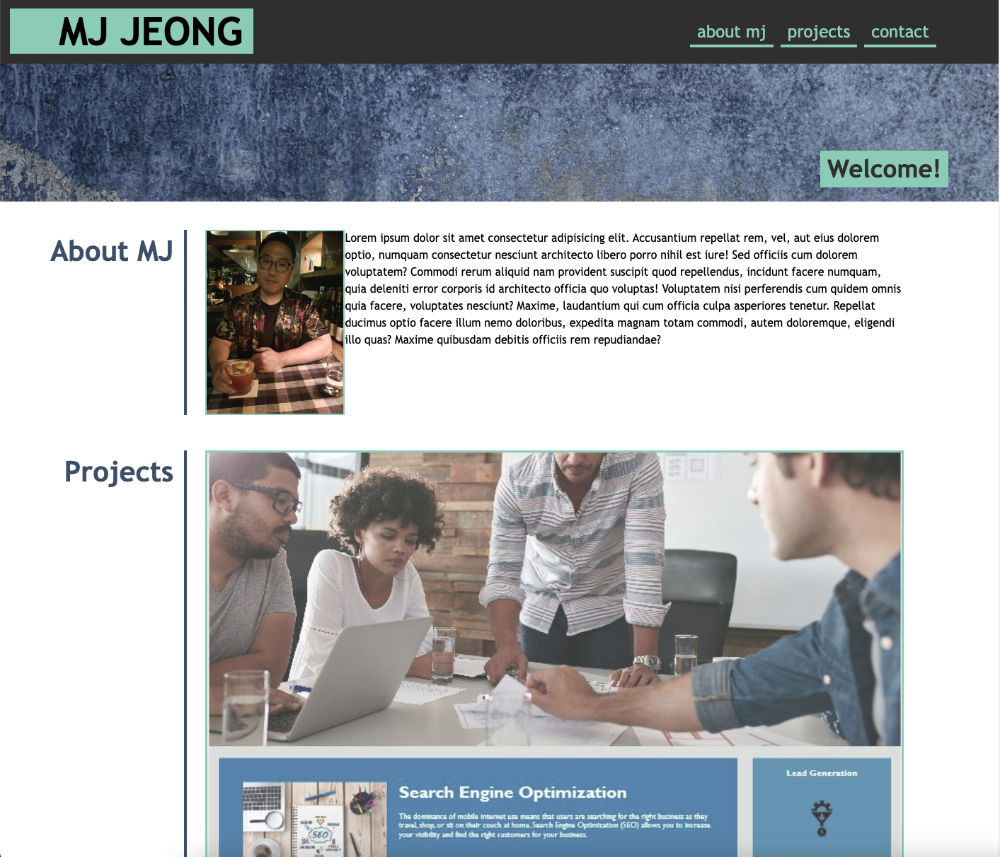

# Portfolio

## Description:
This portfolio page includes the name, recent photo, links to 
section about them, previous projects and how to contact me. It was really fun to apply what I have learned in class inclduing the time i spent to research CSS grid, media query and on.

## Tools
- HTML
- CSS

## Table of Contents

- [Usage](#usage)
- [Credits](#credits)
- [License](#license)
- [Mock-up](#mock-up)

## Usage
- Github page (https://github.com/mjtic/module2-portfolio/)
- URL (https://mjtic.github.io/portfolio/)

## Credits
- As part of bootcamp module 2 challenged I have referenced sites shown below including mini-challenge 2 within UT-Austin bootcamp program:
https://developer.mozilla.org/en-US/docs/Web/CSS/grid-template-columns
https://developer.mozilla.org/en-US/docs/Web/CSS/grid-template-columns
https://css-tricks.com/almanac/properties/g/grid-template-columns/
## License

Please refer to the LICENSE in the repo.

## Mock-up##
https://github.com/the-Coding-Boot-Camp-at-UT/UTA-VIRT-FSF-FT-12-2022-U-LOLC/raw/main/02-Advanced-CSS/02-Challenge/Assets/02-advanced-css-homework-demo.gif
